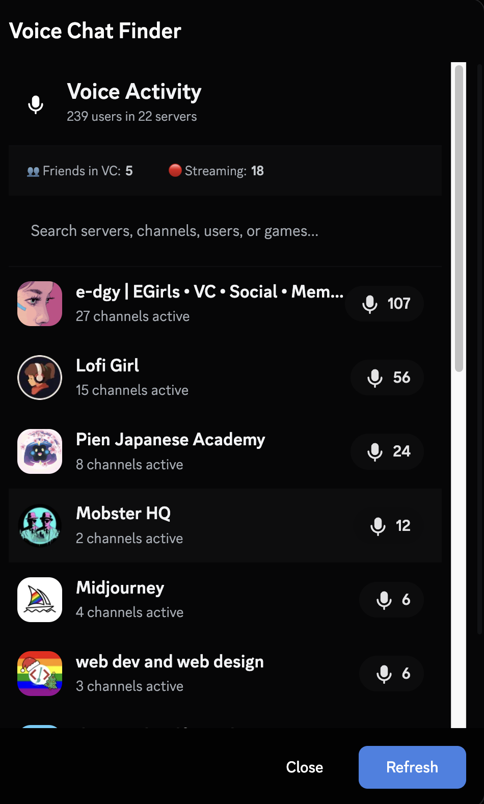
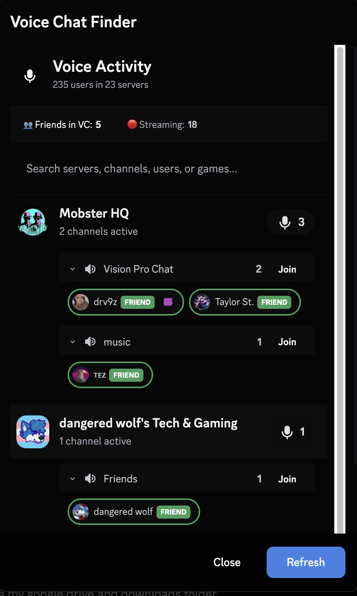

# VoiceChatFinder

A BetterDiscord plugin that adds a button to find all servers with active voice chats.

## Screenshots

  
  

## Features

- **Voice Activity Overview** - See all servers with active voice channels at a glance
- **User Details** - View who's in each voice channel with avatars and activity status
- **Friend Highlighting** - Friends are highlighted with a green border and "FRIEND" badge
- **"Me" Badge** - Easily spot yourself in voice channels with a "ME" badge
- **Streaming Indicators** - See who's streaming or has their camera on
- **Activity Status** - See what games/apps users are playing
- **Search** - Search across servers, channels, users, or games
- **Clickable Filters** - Filter by "Friends in VC" or "Streaming" users
- **Quick Join** - Join any voice channel directly from the modal
- **Green Indicator** - Button shows a green dot when there's voice activity

## Installation

1. Download [VoiceChatFinder.plugin.js](./VoiceChatFinder.plugin.js)
2. Place it in your BetterDiscord plugins folder:
   - **Windows:** `%appdata%/BetterDiscord/plugins`
   - **macOS:** `~/Library/Application Support/BetterDiscord/plugins`
   - **Linux:** `~/.config/BetterDiscord/plugins`
3. Enable the plugin in BetterDiscord settings

## Usage

1. Look for the microphone button in your user panel (next to mute/deafen buttons)
2. Click it to open the Voice Chat Finder modal
3. Browse servers with active voice channels (sorted by most active)
4. Click a server to expand and see individual channels
5. Click a channel to see all users in it
6. Use the search bar to find specific servers, channels, or users
7. Click "Friends in VC" or "Streaming" stats to filter results
8. Click "Join" to join a voice channel directly

## Changelog

### v3.1.0
- Added clickable filters for "Friends in VC" and "Streaming"
- Added "ME" badge to identify yourself in voice channels
- Friends filter now includes yourself

### v3.0.0
- Complete rewrite with new UI
- Added search functionality
- Added friend highlighting
- Added streaming/video indicators
- Added activity status display
- Added user chips with profile click support

## License

MIT
